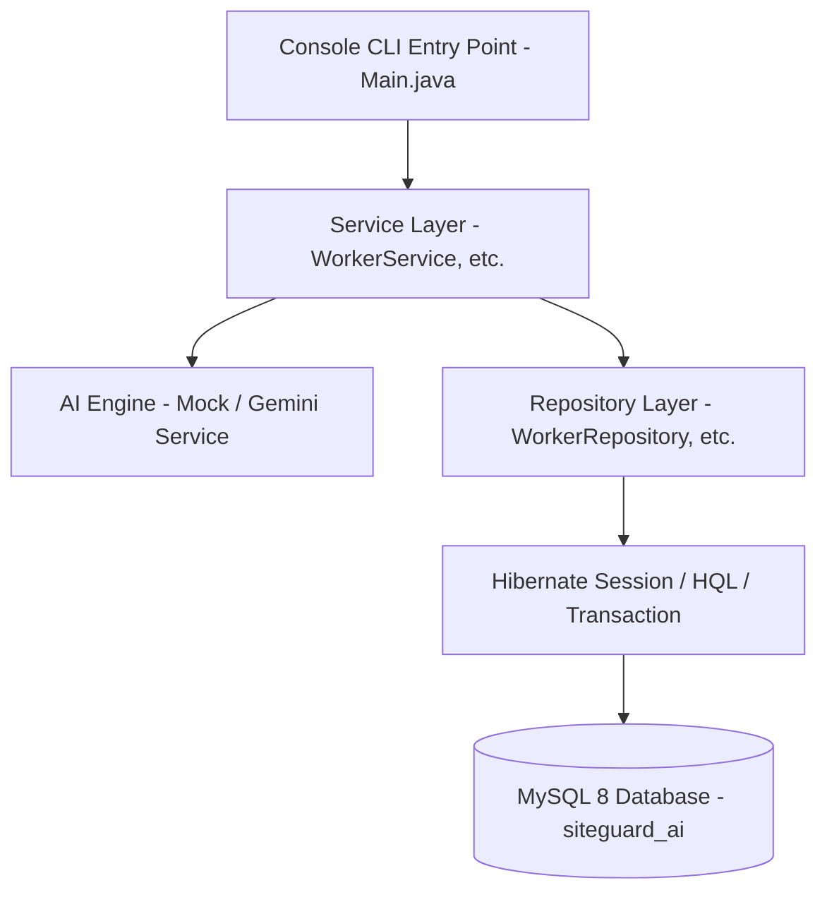

# SiteGuard AI

> **AI-Powered Construction Site Safety Monitoring & Management System**  
> Technology Focus: Java 17 | Hibernate ORM 6.x | MySQL 8+ | AI Safety Detection

---

## 📌 Project Overview

**SiteGuard AI** is an enterprise-grade construction site safety management system built with **Java 17** and **Hibernate ORM 6.x**. The application monitors safety compliance across construction projects, physical sites, CCTV cameras, and workers. It captures computer-vision safety detections (such as missing helmets, missing safety vests, or restricted zone breaches), generates rule-based safety violations, triggers real-time alerts, and maintains a complete audit log.

This repository is specifically the **Hibernate ORM Implementation** using hand-crafted Repositories with Hibernate `Session`, `Transaction`, `HQL` queries, and single point of `SessionFactory` management.

---

## 🚀 Technology Stack

- **Java Version**: JDK 17
- **ORM Framework**: Hibernate ORM `6.6.2.Final`
- **Persistence Specification**: Jakarta Persistence API `3.2.0`
- **Database**: MySQL 8.x
- **JDBC Driver**: MySQL Connector/J `9.2.0`
- **Build Tool**: Apache Maven
- **Logging**: SLF4J `2.0.16` + Logback `1.5.16`
- **Testing**: JUnit 5 (`5.11.4`)
- **AI Module**: Mock AI Safety Detection Engine + Optional Google Gemini AI Integration

---

## 📐 Architecture & Layering

The application follows a clean 5-tier layered architecture:



### Key Design Patterns:
1. **Singleton Pattern**: `HibernateUtil` provides a thread-safe `SessionFactory`.
2. **Repository Pattern**: Encapsulates all Hibernate `Session` CRUD and `HQL` queries without Spring Data dependency.
3. **Service Layer**: Implements input validation, business logic, transaction boundaries, and audit logging.
4. **Strategy / Service Abstraction**: `AiDetectionService` interface with `MockAiDetectionService` and `GeminiAiDetectionService`.

---

## 🗄️ Database Design & Entities

The system maps 10 core entities corresponding to the database schema in `SiteGuard_AI_Complete_Database_Documentation.pdf`:

| # | Entity / Table | Description | Primary Key / Relations |
|---|---|---|---|
| 1 | `User` (`users`) | System users and safety officers | PK `id`, Role ENUM |
| 2 | `Project` (`projects`) | Construction projects master data | PK `id`, Status ENUM |
| 3 | `Site` (`sites`) | Physical project zones/sites | PK `id`, FK `project_id` |
| 4 | `Camera` (`cameras`) | CCTV camera configurations | PK `id`, FK `site_id` |
| 5 | `Worker` (`workers`) | Site workers & contractor info | PK `id`, FK `project_id`, Unique `employee_code` |
| 6 | `SafetyRule` (`safety_rules`) | Configurable safety rules | PK `id`, FK `project_id`, Severity ENUM |
| 7 | `Detection` (`detections`) | Raw AI computer-vision detections | PK `id`, FK `camera_id`, FK `worker_id` |
| 8 | `Violation` (`violations`) | Confirmed safety violations | PK `id`, FK `detection_id`, FK `worker_id`, FK `safety_rule_id` |
| 9 | `Alert` (`alerts`) | Automated incident notifications | PK `id`, FK `violation_id`, Severity ENUM |
| 10 | `AuditLog` (`audit_logs`) | System activity audit history | PK `id`, Action, Entity tracking |

---

## ⚙️ Configuration & Environment Variables

Database configuration is managed in `src/main/resources/hibernate.cfg.xml` and dynamically enhanced by `HibernateUtil`.

### Supported Environment Variables:
- `DB_URL`: MySQL connection URL (Default: `jdbc:mysql://localhost:3306/siteguard_ai`)
- `DB_USERNAME`: MySQL username (Default: `root`)
- `DB_PASSWORD`: MySQL password (Default: `root` or fallback)
- `GEMINI_API_KEY`: Optional API key for Google Gemini AI integration

---

## 🛠️ Database Setup

### Option 1: Automatic Schema Creation (Recommended)
Create the MySQL database once:
```sql
CREATE DATABASE siteguard_ai CHARACTER SET utf8mb4 COLLATE utf8mb4_unicode_ci;
```
Hibernate will automatically create or update all 10 tables on startup using `hibernate.hbm2ddl.auto=update`.

### Option 2: Manual Script Execution
Run the provided SQL DDL script located at:
`src/main/resources/database/schema.sql`

---

## 💻 How to Build & Run

### 1. Compile the Project
```bash
mvn clean compile
```

### 2. Run Unit Tests
```bash
mvn test
```

### 3. Run the Main Console Application
```bash
mvn exec:java -Dexec.mainClass="com.siteguard.Main"
```

Or execute directly with Java after compilation:
```bash
java -cp target/classes:target/dependency/* com.siteguard.Main
```

---

## 🔁 Complete Worker CRUD Operations

The CLI menu demonstrates full CRUD for `Worker`:

1. **CREATE**: Add worker details (Name, unique Employee Code, Contractor, Status).
2. **READ**: Retrieve worker by ID, query worker by Employee Code (`HQL`), list all workers (`HQL`), list active workers (`HQL`).
3. **UPDATE**: Modify name, contractor name, or status (`ACTIVE` / `INACTIVE`).
4. **DELETE**: Remove worker by ID.

---

## 🤖 AI Safety Detection Engine

- **Mock AI Service (`MockAiDetectionService`)**: Default offline simulation that evaluates camera frames or worker images for violations:
  - `HELMET_MISSING` (HIGH Severity)
  - `VEST_MISSING` (MEDIUM Severity)
  - `RESTRICTED_AREA_ENTRY` (CRITICAL Severity)
  - `FULL_PPE_COMPLIANT` (No violation)
- **Automatic Incident Pipeline**: When a safety violation is detected:
  1. Saves `Detection` in `detections` table.
  2. Creates `Violation` record in `violations` table.
  3. Generates `Alert` in `alerts` table if severity is `HIGH` or `CRITICAL`.
- **Gemini AI Integration (`GeminiAiDetectionService`)**: Optional cloud AI integration using `GEMINI_API_KEY`.

---

## 🔮 Future Enhancements

- Real-time RTSP video stream processing via OpenCV / YOLO
- Spring Boot REST APIs and WebSocket alerts
- React Web Dashboard & Mobile Push Notifications
- Automated email alerts to safety managers
